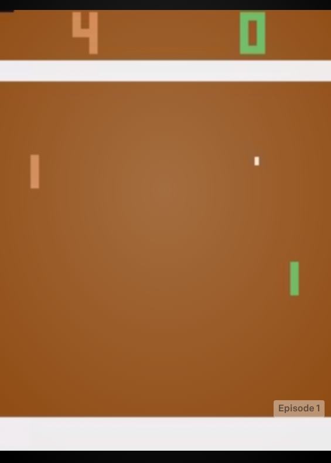

# DeepRL-Pong
Deep Reinforcement Learning bot playing Pong game.


--------------


--------------
## Quick start

### Environment

#### Using docker

You can run the environment using provided Dockerfile,

```
docker compose up
```

after that Jupyter Notebook will be run at `localhost:7777`.

#### Building environment locally

You can also build the environment locally. All packages needed to run our code are listed in the `requirements.txt` file. It's convenient to use virtualenv, nice virtualenv tutorial [here](https://computingforgeeks.com/fix-mkvirtualenv-command-not-found-ubuntu/)
```bash
which python3.8
mkvirtualenv -p <path to python3> <name>
workon <name>
```

```bash
pip install --upgrade pip
pip install -r requirements.txt
```

Downloading ROM (https://github.com/openai/atari-py#roms):
* Download it from http://www.atarimania.com/rom_collection_archive_atari_2600_roms.html

```bash
unrar x Roms.rar
unzip ROMS.zip 
python -m atari_py.import_roms ROMS
```

Now you can run:
```bash
python gym_demo.py
```