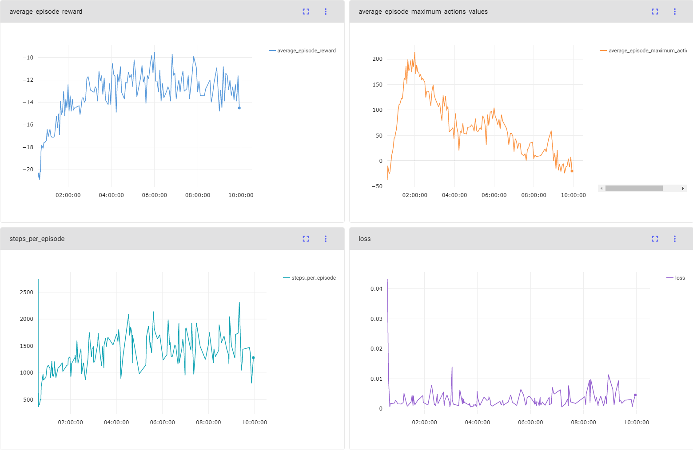

# DeepRL-Pong
> Deep Reinforcement Learning bot playing Pong game based on: https://arxiv.org/abs/1312.5602

--------------


--------------

## Table of contents
- [Requirements](#requirements)
- [Quick start](#quick-start)
  * [Using docker](#using-docker)
  * [Building environment locally](#building-environment-locally)
- [Confing](#confing)
- [Running the code](#running-the-code)
- [Training statistics](#training-statistics)
- [Status](#status)
- [Credits](#credits)

## Requirements
* Python - version 3.8.10
* gym[atari]
* PyTorch - version 1.8.1
* numpy
* comet-ml

## Quick start

### Using docker

You can run the environment using provided Dockerfile,

```
docker compose up
```

after that Jupyter Notebook will be run at `localhost:7777`.

### Building environment locally
You can also build the environment locally. All packages needed to run our code are listed in the `requirements.txt` file. It's convenient to use virtualenv, nice virtualenv tutorial [here](https://computingforgeeks.com/fix-mkvirtualenv-command-not-found-ubuntu/)
```bash
which python3.8
mkvirtualenv -p <path to python3> <name>
workon <name>
```

```bash
pip install --upgrade pip
pip install -r requirements.txt
```

Downloading ROM (https://github.com/openai/atari-py#roms):
* Download it from http://www.atarimania.com/rom_collection_archive_atari_2600_roms.html

```bash
unrar x Roms.rar
unzip ROMS.zip 
python -m atari_py.import_roms ROMS
```

##### CometML api key

To log training parameters to the comet-ml tag you should also run:
```
export COMET_ML_API_KEY=your-comet-api-key
```

## Confing
We're using the YAML config file `config.yml`. You can set there both network parameters and environment settings, like the device on which you want to run the code or CometML settings.

If you want to use a pre-trained model you have to specify the `LOAD_MODEL` parameter as a name of the `model_dump.pth` file in `models/saved_models` directory, for example:
```
LOAD_MODEL: model_episode_5700.pth
```

## Running the code
To test if your environment is set correctly you can run a simple demo:
```bash
python gym_demo.py
```

To run the training you have to modify the `config.yml` file and then run.
```
python main.py --mode train
```

To test your model you can speficy `LOAD_MODEL` parameter as described [here](#confing), and the run:
```
python main.py --mode test
```

You can also observe a single game played by your model by running:
```
python main.py --mode demo
```

## Training statistics
During the training model logs all useful statistics to the CometML. You should set up the workspace, project name, tag, and name in the config file. Example of training statistics look like this:


## Status
Project: _finished_

## Credits
* [@MatMarkiewicz](https://github.com/MatMarkiewicz)
* [@mdragula](https://github.com/mdragula)
* [@TheFebrin](https://github.com/TheFebrin)
